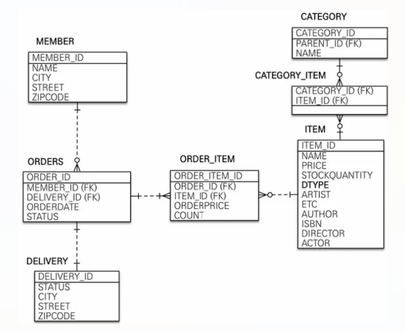

# 1. 프로젝트 환경설정

### 📌 프로젝트 설정

**Project : Gradle**

🔎 maven과 gradle은 무슨 차이가 있을까 ?

maven과 gradle은 둘 다 빌드 도구(build tool)이다. gradle 설정 파일이 좀 더 간결하다는 것 말고 별로 큰 차이는 없다. 옛날에 만들어진 프로젝트들은 주로 maven을 사용하였고, 최근에 만들어진 프로젝트들은 주로 gradle을 사용한다.

|  | (1) 옛날 spring 프로젝트 | (2) 요즘 spring 프로젝트 |
| --- | --- | --- |
| build tool | maven | gradle |
| database ORM | mybatis | JPA |
| view | jsp | thymeleaf |
| 설정 파일 이름 | pom.xml | build.gradle |

은행, 신용카드, 정부 등의 대형 프로젝트들은 10년 20년 전에 시작되어, 계속 운영되고 있고, 소스코드 규모가 매우 커서 새 기술로 다시 구현하는 것이 매우 어려운 대형 프로젝트들이 많다. 이런 프로젝트들은 주로 (1)번 기술들을 사용한다.

작은 쇼핑몰, 서비스 등 중소형 프로젝트들은비교적 최근에 개발되었고, 상대적으로 소스코드 규모가 작아서, 새 기술로 다시 구현하는 것도 상대적으로 쉽다. 이런 프로젝트들은 주로 (2)번 기술들을 사용한다.

즉 오래전에 시작된 대형 프로젝트에 참여하게 된다면 (1)번 기술을 사용하게 될 확률이 높고 비교적 최근에 시작된 중소형 프로젝트에 참여하게 된다면 (2)번 기술을 사용하게 될 확률이 높다.

**사용 기능 : Spring Web , Thymeleaf, jpa, h2 database, lombok 등**


✅ **Spring Web**

Spring Web MVC 라이브러리

✅ **Spring Boot DevTools**

프로젝트를 실행할 때, 프로젝트를 재시작하지 않아도 수정된 소스 코드가 실행에 즉시 반영될 수 있도록 해주는 개발 도구

✅ **Thymeleaf**

뷰(view) 템플릿 엔진


### 📌 View 환경 설정

▶️ HelloController

```c
@Controller
public class HelloController {

    @GetMapping("hello")
    public String hello(Model model){
        model.addAttribute("data", "hello!!");
        return "hello";
    }
}
```

▶️ Thymeleaf 템플릿엔진 동작 확인 (hello.html)

```c
<!DOCTYPE HTML>
<html xmlns:th="http://www.thymeleaf.org">
<head>
    <title>Hello</title>
    <meta http-equiv="Content-Type" content="text/html; charset=UTF-8" />
</head>
<body>
<p th:text="'안녕하세요. ' + ${data}" >안녕하세요. 손님</p>
</body>
</html>
```

**✅@Controller**

컨트롤러 클래스에 이 어노테이션(annotation)을 붙여주어야 한다. 이것을 붙여주지 않으면 컨트롤러 클래스가 실행되지 않는다. 404 Not Found 에러가 발생할 것이다.

**✅액션 메소드**

웹브라우저가 어떤 URL을 웹서버에 요청하면, 그 요청된 URL에 해당하는 컨트롤러의 어떤 메소드가 자동으로 호출된다. 이렇게 웹브라우저의 요청에 의해서 자동으로 호출되는 컨트롤러의 메소드를 액션 메소드라고 부른다.

**✅@GetMapping 어노테이션과 액션 메소드 URL**

액션 메소드에 붙은 @RequestMapping("/") 어노테이션의 "/" 부분은 그 액션 메소드를 호출하기 위한 URL 이다. http://localhost:8080/ URL을 웹브라우저가 웹서버에 요청하면, 웹서버에서 HelloController 컨트롤러 클래스의 index 액션 메소드가 자동으로 호출되어 실행된다. 자동으로 호출할 액션 메소드를 찾을 때 컨트롤러 클래스 이름이나 액션 메소드의 이름은 상관 없고, @GetMapping 어노테이션에 등록된 URL만 일치하면 된다. 그리고 HTTP request method는 GET 이어야 한다. 만약 요청된 URL과 일치하는 액션 메소드가 없다면, 404 Not Found 에러가 발생할 것이다.

**✅컨트롤러 액션 메소드의 리턴 값**

컨트롤러의 액션 메소드는 문자열을 리턴한다. 컨트롤러의 액션 메소드가 리턴하는 문자열은, 뷰(View) 파일의 이름이다. 컨트롤러의 액션 메소드가 리턴된 후, 뷰 파일이 실행된다. 액션 메소드가 리턴한 이름의 뷰 파일이 실행된다.

### 📌 H2 데이터베이스 설치

https://www.h2database.com/html/main.html 에서 h2 다운로드

`C:\lecture\h2\bin` 에서 h2.bat 실행

### 📌 JPA와 DB 설정, 동작확인

쿼리파라미터 로그 남기기

`implementation 'com.github.gavlyukovskiy:p6spy-spring-boot-starter:1.9.0'`

SQL 쿼리뿐 아니라 바인딩된 파라미터까지 로그에 출력한다.

콘솔에도 쿼리가 파라미터와 함께 출력되어 JPA의 실제 실행 쿼리와 파라미터 바인딩 상태를 쉽게 확인할 수 있다.

# 2. 도메인 분석 설계



### 📌 엔티티 설계시 주의점

1. 엔티티에는 가급적 Setter를 사용하지 말자.

-    변경 포인트가 너무 많아서, 유지보수가 어렵다.

2. 모든 연관관계는 지연로딩으로 설정 !

- 즉시 로딩(`EAGER`)은 예측이 어렵고, 어떤 SQL이 실행될지 추적하기 어렵다.
- 특히 JPQL을 실행할 때 N+1 문제가 발생할 수 있다. 실무에서는 모든 연관관계는 지연 로딩(`LAZY`)으로 설정해야 한다.
- 연관된 엔티티를 함께 DB에서 조회해야 할 경우, fetch join 또는 엔티티 그래프 기능을 사용한다.
- `@XToOne`(OneToOne, ManyToOne) 관계는 기본이 즉시 로딩이므로 직접 지연 로딩으로 설정해야 한다.