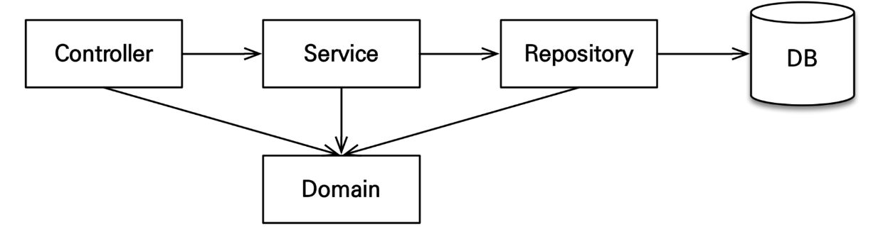

# 📌**JPA의 핵심 개념**

**엔티티 매니저, 영속성 컨텍스트, 트랜잭션**

1. **엔티티 매니저 :** 영속성 컨텍스트를 관리하고 데이터베이스와 상호작용하는 JPA의 중심 객체.
2. **영속성 컨텍스트 :** 엔티티를 관리하고, 캐싱, 변경 감지, 쓰기 지연 등을 통해 성능과 일관성을 보장.
3. **트랜잭션 :** 작업 단위를 묶어 데이터 무결성과 안정성을 확보하는 메커니즘.

JPA의 이들 개념은 객체와 관계형 데이터베이스 간의 매핑을 효율적이고 안전하게 수행하는 데 필수적입니다.

++++ 어려운 개념들에 대해서 정리를 해보았습니다.

---

## 🔎 **엔티티 매니저 (EntityManager)**

- **엔티티 매니저**는 JPA에서 영속성 컨텍스트를 관리하고 데이터베이스와 상호작용을 담당하는 객체입니다.
- 애플리케이션 코드에서 데이터베이스와의 CRUD 작업을 처리하며, JPA의 핵심 역할을 수행합니다.

### **엔티티 매니저의 주요 기능**

1. **영속성 컨텍스트 관리**:
    - 엔티티 매니저는 **영속성 컨텍스트**를 생성하고 관리합니다.
    - **영속성 컨텍스트**는 JPA의 중요한 논리적 저장소로, 엔티티를 캐싱하고 상태를 관리합니다.
2. **엔티티의 생명주기 관리**:
    - 엔티티 매니저는 엔티티의 생명주기(비영속, 영속, 준영속, 삭제 상태)를 관리하며, 데이터베이스와 객체 상태를 동기화합니다.
3. **CRUD 기능 제공**:
    - `persist`(저장), `merge`(수정), `remove`(삭제), `find`(조회) 메서드를 통해 엔티티를 관리합니다.
4. **트랜잭션 관리 지원**:
    - 트랜잭션 경계를 설정하고, 트랜잭션 종료 시 변경 사항을 데이터베이스에 반영(`flush`)합니다.
5. **JPQL 실행**:
    - JPQL(Java Persistence Query Language)을 사용하여 객체 중심의 쿼리를 작성하고 실행합니다.
    - 엔티티 매니저는 JPQL을 SQL로 변환하여 데이터베이스와 상호작용합니다.

---

## 🔎 **영속성 컨텍스트 (Persistence Context)**

- **영속성 컨텍스트**는 JPA에서 엔티티를 관리하는 논리적인 저장소입니다.
- 엔티티 매니저는 이 컨텍스트를 통해 엔티티의 상태를 관리하며, 데이터베이스와의 동기화를 수행합니다.

`영속성`: 데이터를 생성한 프로그램이 종료되어도 사라지지 않는 데이터의 특성

`컨텍스트`: "주변 환경"이나 "상황"을 의미

`영속성 컨텍스트`: 엔티티(데이터)를 영구 저정하는 환경으로 눈에 보이지 않는 논리적인 개념.

### **영속성 컨텍스트의 주요 특징**

1. **1차 캐시**:
    - 영속성 컨텍스트는 데이터베이스에서 조회한 엔티티를 메모리에 저장합니다.
    - 동일한 트랜잭션 내에서 동일한 엔티티를 다시 조회하면 데이터베이스에 접근하지 않고 메모리에서 반환합니다.
2. **동일성 보장 (Identity)**:
    - 동일한 트랜잭션에서 동일한 엔티티를 조회할 경우 **같은 객체 인스턴스**를 반환합니다.
    - 객체 비교(`==`)가 용이합니다.
3. **쓰기 지연 (Transactional Write-Behind)**:
    - 데이터베이스에 직접 변경 작업을 수행하지 않고, 트랜잭션이 커밋될 때까지 변경 내용을 저장소에 보관합니다.
    - 한 번에 배치 처리하여 성능을 최적화합니다.
4. **변경 감지 (Dirty Checking)**:
    - 엔티티의 필드 값이 변경되었는지 자동으로 감지하여 변경 내용을 트랜잭션 커밋 시 데이터베이스에 반영합니다.
5. **지연 로딩 (Lazy Loading)**:
    - 필요할 때만 연관된 데이터를 로드하여 메모리 사용을 줄이고 성능을 최적화합니다.

---

## 🔎**트랜잭션 (Transaction)**

송금 시스템에서 한 계좌에서 돈을 빼고 다른 계좌로 넣는 작업은 반드시 함께 성공하거나 함께 실패해야 합니다. 만약 첫 번째 작업이 성공하고 두 번째 작업이 실패하면 돈이 사라지는 문제가 발생할 수 있습니다.

이 문제를 해결하려면 두 작업을 **트랜잭션으로 묶어야 합니다**. 트랜잭션은 모든 작업이 성공하면 변경사항을 저장하고, 하나라도 실패하면 **롤백**하여 이전 상태로 되돌립니다. 이를 통해 데이터 무결성과 신뢰성을 보장할 수 있습니다.

이와 관련된 내용이 바로 트랜잭션입니다 ~

- 트랜잭션은 **일련의 작업을 하나의 단위로 묶어 처리**하는 개념으로, 데이터베이스의 무결성을 보장합니다.
- JPA에서는 트랜잭션을 통해 데이터 변경 작업을 안전하게 수행합니다.

### **트랜잭션의 주요 특징 (ACID)**

1. **원자성 (Atomicity)**:
    - 트랜잭션의 작업은 모두 성공하거나 모두 실패해야 합니다.
    - 일부 작업만 성공하는 상태는 허용되지 않습니다.
2. **일관성 (Consistency)**:
    - 트랜잭션의 작업 전후 데이터의 일관성이 유지되어야 합니다.
3. **독립성 (Isolation)**:
    - 동시에 실행되는 트랜잭션은 서로 간섭하지 않고 독립적으로 실행됩니다.
4. **영구성 (Durability)**:
    - 트랜잭션이 커밋되면 변경 사항은 영구적으로 데이터베이스에 반영됩니다.

---

# 📌 애플리케이션 아키텍쳐

### 1️⃣ **계층형 구조 (Layered Architecture)**

- controller : 웹 계층
- service : 비즈니스 로직, 트랜잭션 처리
- repository : JPA를 직접 사용하는 계층, 엔티티 매니저 사용
- domain : 엔티티가 모여 있는 계층, 모든 계층에서 사용



- 애플리케이션을 **표현(Presentation)**, **서비스(Service)**, **영속성(Persistence)** 계층으로 나누어 설계
- 계층 간 호출은 **위에서 아래로** 진행.

**장점**:

- **명확한 역할 분리**: 각 계층의 역할이 명확.
- **단순하고 직관적**: 구조 이해가 쉬움.
- **테스트 용이성**: 계층별 독립 테스트 가능.

**단점**:

- **비즈니스 로직 중복**: 서비스 계층에 로직 집중.
- **확장성 부족**: 복잡한 도메인 처리에 어려움.
- **성능 문제**: 계층 간 호출로 성능 저하 가능.

### 2️⃣ **도메인형 구조 (Domain-Centric Architecture)**

- **도메인 중심** 설계
- 비즈니스 로직이 도메인 계층에 집중되며, 외부 시스템(DB, UI 등)은 도메인 계층을 호출.

**장점**:

- **비즈니스 로직 집중**: 코드 응집도가 높음.
- **확장성 및 유지보수성 우수**: 도메인 중심으로 설계되어 변경에 유연.

**단점**:

- **복잡한 설계**: 초기 설계가 어려움.
- **오버엔지니어링 위험**: 단순 애플리케이션에 과도한 설계 가능.

### 3️⃣ **계층형 구조 vs 도메인형 구조**

| **구분** | **계층형 구조** | **도메인형 구조** |
| --- | --- | --- |
| **중심 요소** | 계층(UI, 서비스, 영속성) | 도메인(비즈니스 로직 중심) |
| **비즈니스 로직** | 서비스 계층에 집중 | 도메인 계층에 집중 |
| **적합성** | 단순 CRUD 애플리케이션 | 복잡한 비즈니스 로직 애플리케이션 |

### ✏️ 내가 내린 결론 !!

- **계층형 구조**는 단순하고 빠른 개발에 적합.
- **도메인형 구조**는 복잡한 도메인을 다루는 확장성과 유지보수성에 유리.
  필요에 따라 적절히 선택!

# 📌 **회원 서비스 개발**

## **1️⃣ @Transactional(readOnly = true)**

- 읽기 전용 메서드에서 사용하는 **트랜잭션 어노테이션**.
- 데이터 변경 없이 **조회만 수행**하는 메서드에 사용.
- **영속성 컨텍스트의 `flush` 작업을 생략**하여 성능 향상.
- 읽기 전용 트랜잭션에서 변경 작업을 시도하면 예외가 발생.

---

## **2️⃣ 의존성 주입 방식**

### **1. 필드 주입 (Field Injection)**

- `@Autowired` 어노테이션을 필드 위에 선언하여 의존성을 주입.
- 간단하고 코드가 직관적.

```java
@Service
@Transactional(readOnly = true)
public class MemberService {
    @Autowired
    private MemberRepository memberRepository;
}
```

- **단점**:
    1. **`final` 키워드 사용 불가**:
        - `final`을 사용할 수 없어 **불변성**을 보장하지 못함.
    2. **테스트 불편**:
        - 스프링 컨텍스트를 실행해야만 의존성 주입이 가능하여 **단위 테스트 작성이 어려움**.
    3. **런타임 의존성 문제**:
        - 의존성을 명시적으로 전달하지 않아 객체 생성 시 의존성 누락을 컴파일 시점에 확인 불가.

---

### **2. 생성자 주입 (Constructor Injection)**

- **생성자**를 통해 의존성을 주입.
- Spring이 객체 생성 시 **의존성을 한 번만 설정**.

```java
@Service
@Transactional(readOnly = true)
public class MemberService {

    private final MemberRepository memberRepository;

    @Autowired // 생성자가 하나만 있으면 생략 가능
    public MemberService(MemberRepository memberRepository) {
        this.memberRepository = memberRepository;
    }
}

```

- **장점**:
    1. **불변성 확보**:
        - `final` 키워드 사용 가능 → 의존성을 변경할 수 없음.
    2. **컴파일 시점 검증**:
        - 생성자에서 의존성을 초기화하지 않으면 컴파일 시점에 오류 발생.
    3. **테스트 용이성**:
        - 스프링 컨텍스트 없이도 객체를 직접 생성해 **단위 테스트 가능**.
    4. **스프링 공식 권장 방식**:
        - 안정성과 유지보수성을 고려해 Spring Framework에서 권장.

---

### **3. Lombok의 @RequiredArgsConstructor 사용**

- `@RequiredArgsConstructor`는 `final`이 붙은 필드에 대해 **생성자를 자동 생성**.
- 코드의 간결성과 가독성을 높임.
- **Spring과 함께 자주 사용되는 방식**.

```java
@Service
@Transactional(readOnly = true)
@RequiredArgsConstructor
public class MemberService {

    private final MemberRepository memberRepository;
}

```

---

## **3️⃣ 회원 가입 메서드**

```java
@Transactional
public Long join(Member member) {
    validateDuplicateMember(member); // 중복 회원 검증
    memberRepository.save(member);   // 회원 저장
    return member.getId();           // 저장된 회원 ID 반환
}

private void validateDuplicateMember(Member member) {
    List<Member> findMembers = memberRepository.findByName(member.getName());
    if (!findMembers.isEmpty()) {
        throw new IllegalStateException("이미 존재하는 회원입니다.");
    }
}
```

- `@Transactional`: 메서드 실행 시 데이터 변경(쓰기 작업)을 보장.
- `validateDuplicateMember`: 이미 존재하는 회원인지 확인. 중복 회원이 있으면 예외를 던짐.
- `memberRepository.save(member)`: 영속성 컨텍스트에 저장.
- `findByName`: 이름으로 회원을 조회.
- 중복 회원이 있으면 `IllegalStateException`을 발생시켜 추가 등록을 방지.

---

## **4️⃣ 필드 주입 vs 생성자 주입**

| **구분** | **필드 주입** | **생성자 주입** |
| --- | --- | --- |
| **작성 방식** | `@Autowired`를 필드에 선언 | 생성자에서 의존성 전달 |
| **`final` 사용** | 불가 | 가능 (객체 불변성 확보) |
| **컴파일 시 검증** | 불가 (런타임 오류 가능) | 가능 (컴파일 시 누락 확인 가능) |
| **테스트 용이성** | 낮음 (스프링 컨텍스트 필요) | 높음 (스프링 없이 단위 테스트 가능) |
| **권장 여부** | 권장하지 않음 | **Spring 공식 권장** |

---

### 요약

- **필드 주입**은 간단하지만 테스트와 유지보수 측면에서 단점이 많아 **사용을 지양**.
- **생성자 주입**은 의존성 누락 방지, 불변성 확보, 테스트 편의성을 제공하며 **Spring에서 공식적으로 권장**.
- Lombok의 `@RequiredArgsConstructor`를 사용하면 생성자 주입을 더 간결하게 구현할 수 있어, 실무에서 많이 사용됩니다.