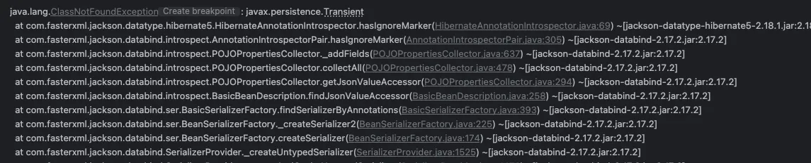
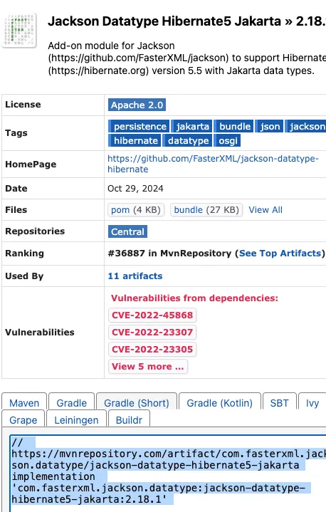
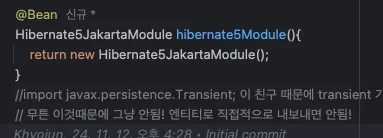
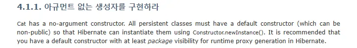

## 간단한 주문 조회 v1 : 엔티티를 직접 노출

### Issue : javax 라이브러리 오류 hibernate5 버전 사용시!



그냥 hibernate 5 모듈 쓸 경우

```json
implementation 'com.fasterxml.jackson.datatype:jackson-datatype-hibernate5:2.18.1'
```

spring boot 3.x 기준 이 친구 쓰면 javax 라이브러리 써서 오류 발생 그래서 jakarta 용 라이브러리가 있음



```json
    implementation 'com.fasterxml.jackson.datatype:jackson-datatype-hibernate5-jakarta:2.18.1'

```



정상적으로 잘 됩니다! 라이브러리를 잘 보고 최신화 해서 사용합시다!

### 본격 정리

## 4챕터 1강 - 엔티티로

- 엔티티 사용 x → 이번 강의에서도 마찬가지로 서로 순환하게 되는 case
    - @jsonIgnore 를 사용해서 처리
    - LAZY 로딩으로 인하여 처음엔 proxy로 긁어오는 경우가 있기에 byteBuddy라는 에러가 발생하게 된다.
- 등등의 오류들이 계속 나타나게됨!
- 그래서 제발 엔티티로 뱉지 말고 그리고 dto로 감싸서 뱉던가 해라!

## 4챕터 2강 - 엔티티를 dto로 변환해서

- 이전과 달리 변화점 : 엔티티에 종속적이지 않는 코드가 되었음! → 엔티티가 변경되어도 괜찮은 형태가 되었다는 뜻!
- 아직 남은 문제! - N+1 문제

```java
        public SimpleOrderDto(Order order) { // dto 에서 엔티티를 받아도 괜찮음! 별로 그렇게 중요한 그런 의미잇는 관계는 아니라서
            orderId = order.getId();
            name = order.getMember().getName();
            orderDate = order.getOrderDate();
            orderStatus = order.getStatus();
            address = order.getDelivery().getAddress();
        }
```

- order 가 2개이면 해당 dto로 변환하는 과정속에서 어떻게 될까?
- 우선 쿼리가 이렇게 나간다! orders 조회 : 쿼리 1번
- 거기서 나온 order 2개 나옴! 각각 1개씩 member 한 번 delivery 1개 조회를 해야함! ㅠㅠ
- 이러면 총 쿼리? 1+ 2+ 2 5번 쿼리가 나가게 된다!
- 그런데 만약 한 번 불렀으면 영속성 컨텍스트에서 조회를 하기 때문에 매번 5번 이 나가는건 또 아니다. 최악이 5번이다.

## 4챕터 3강 -  그래서 fetch join 이라는 것을 사용해보자.

```java
    public List<Order> findAllWithMemberDelivery() {
        return em.createQuery(
                "select o from Order o" +
                        " join fetch o.member m" +
                        " join fetch o.delivery d", Order.class)
                .getResultList();
    }
```

이렇게 긁어오게 될 경우 fetch join으로 긁어오는데 쿼리로는 inner join 방식으로 가져오게 된다! 이렇게 되면 아까 5번에 나갈 쿼리가 한 번에 나가게 되니 쿼리가 여러번 나갈 필요가 없게 조회를 줄이게 되었다!

p.s 사실 fetch join 말고 entity graph 방식이니 여러 가지 방법이 또 있다!

## 4챕터 4강 -  원하는 컬럼만 가져오는게 도움이 될까?

```java
 public List<OrderSimpleQueryDto> findOrderDtos(){
        return em.createQuery(
                "select new lecture.jpa2_practice.repository.OrderSimpleQueryDto(o.id, m.name, o.orderDate, o.status, d.address)" +
                    "from Order o" +
                    " join o.member m" +
                    " join o.delivery d", OrderSimpleQueryDto.class)
```

해당 방식으로 아까 방식에서 원하는 컬럼만 들고왔다! 그렇지만 실제로 이게 성능상~~ 진짜~~~ 큰 차이를 일으킬 수 있을까?

우선 정리해보면 다음과 같았다.

- v3 버전과는 달리 select 절 컬럼 문이 엄청 줄어들었다! 필요한것만 가져왔기 때문에!
- v4가 그러면 더 좋냐? 솔직히 우열 가리기 힘듦
- v4버전을 쓴다면 재사용성이 떨어진다! 이미 어떤 것을 들고와야할 지 다 지정하고 가져오기 때문에!
- 성능도 막상 생각한것보다 말도안되게 좋아지거나 할 껀떡지가 없다! 데이터가 워낙 크면 모를까?
- 그래서 뭐 트래픽에 대해서는 db 조회할때 conn 맺는것은 고민해볼 필요가 있는 point이다.
- 그래서 권장하는 방법으로는 다음과 같다.
    - 엔티티를 dto로 변환하는 방법을 채택
    - 필요하면 fetch join으로 성능 최적화 진행 → 대부분 여기서 해결됨
    - 그래도 안되면 dto 직접 조회
    - 최후의 방법은 JPA가 제공하는 네이티브 sql 이나 spring jdbc template을 사용해서 직접 해결

## 5챕터 - 1 엔티티 조회 뿐만 아니라 이젠 orderItems까지?

- 엔티티로 한 것은 일단 dto로 바꿔야 한다!
- 그러나 이제는 문제가 orderItems 까지 와서 흠…. 기대되는 예상으로 fetch Join안하면 난리날 거 같다.

## 5챕터 - 2 dto로 바꿨다. 그래서?

- 그런데 아까 봤던 것처럼 쿼리 엄청 많이 수행한다! orderItems 로 들어가서 또 item이 2개씩 오우~~~~

## 5챕터 - 3 fetchJoin 도 했는데? 그런데?

- join 을 한 이후 db에서 조회를 해보니 orderId가 겹쳐지는 정보로 row가 많이 조회되는 경우가 있었다! 이를 해결하기 위해 distinct 를 사용하였다!
- 그래서 row 가 적게 호출은 됬는데!!!!
- 문제가 페이징 처리가 안된다! 1대 다 관계에서는! 왜냐하면 데이터가 뻥튀기 된 이후 어떤 데이터를 기준으로 페이지네이션을 해줘야할 지  판단이 안 서기 때문이다!

### JPA에서는 기본 생성자를 왜 사용해야할까?

우선 정리해보자면



왜냐하면 엔티티를 만들때 reflection API 를 통해 객체를 초기화 한다! 그렇기에 생성자가 있는 것들은 reflectionAPI 를 통해 접근할 수 없기 때문에 기본 생성자를 통해 접근을 해줘야한다!

https://docs.jboss.org/hibernate/core/3.3/reference/ko-KR/html/persistent-classes.html

```java
1. 기본생성자가 있어야 한다. 왜? JPA에서 어떤 클래스를 entity 로 사용할 지 바로 알 수 없기 때문에 내부적으로
reflection 을 이용해서 객체를 생성하기 때문이다! 그런데 왜 굳이 기본 생성자? -> 바로 리플렉션을 통해서는 구체적인 생성자 매개변수를 알 수 없기 때문이다.

```

```java
1. 기본생성자가 있어야 한다. 왜? JPA에서 어떤 클래스를 entity 로 사용할 지 바로 알 수 없기 때문에 내부적으로
reflection 을 이용해서 객체를 생성하기 때문이다! 그런데 왜 굳이 기본 생성자? -> 바로 리플렉션을 통해서는 구체적인 생성자 매개변수를 알 수 없기 때문이다.

Spring Data JPA 에서 Entity에 기본 생성자가 필요한 이유는 동적으로 객체 생성 시 Reflection API를 활용하기 때문이다.

JPA는 DB 값을 객체 필드에 주입할 때 기본 생성자로 객체를 생성한 후 Reflection API를 사용하여 값을 매핑한다.

때문에 기본 생성자가 없다면 Reflection은 해당 객체를 생성 할 수 없기 때문에 JPA의 Entity에는 기본 생성자가 필요하다.

그리고 LAZY 타입으로 진행을 하게 된다면 이때 proxy 객체가 원본 객체를 엔티티 객체를 상속받고 사용해야하는데 private 해버리면 그쪽에 접근을 못해버린다고한다.
```

https://new-age-jh.tistory.com/287 어떻게 필드로 넣는지 참고하자!

https://docs.jboss.org/hibernate/core/3.3/reference/ko-KR/html/persistent-classes.html